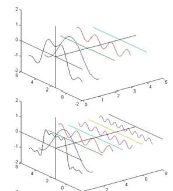
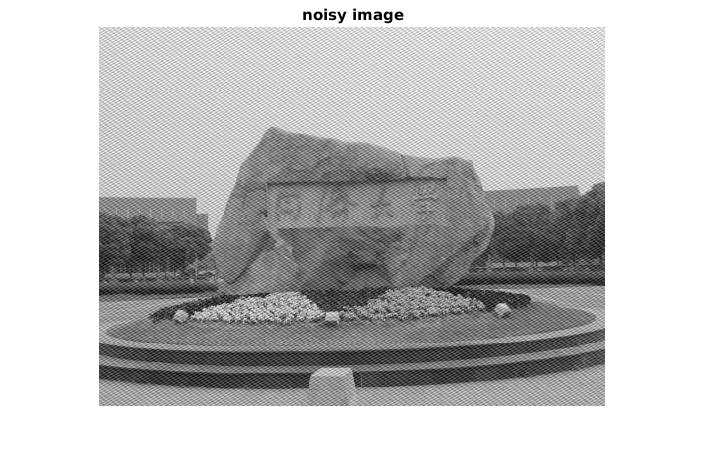
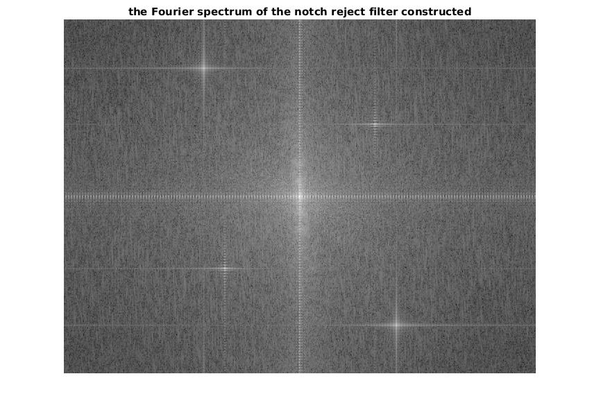
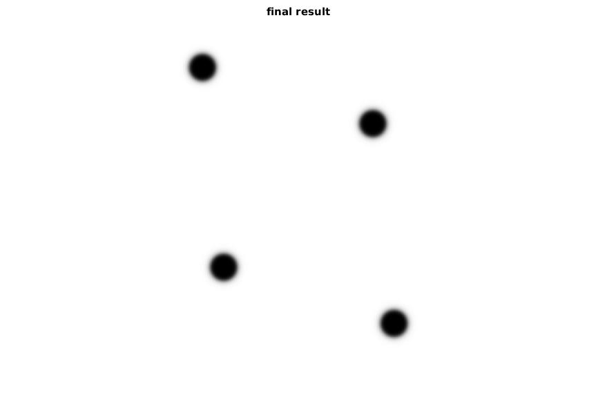
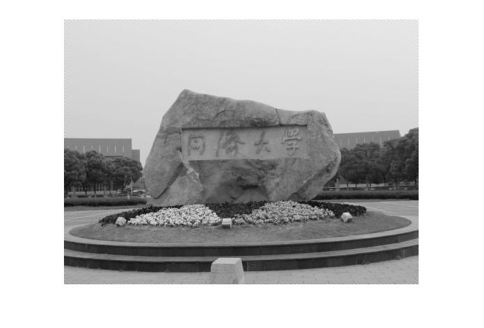

### problem 3

(1) What is the advantage of converting an image from spatial domain to frequency domain? Explain properties of 2-D Fourier transform.

a. By converting the image from spatial domain to frequency domain, the complex components of different frequencies are transformed into many short straight lines, each of whom has an x-coordinate representing the value of frequency and a  y-coordinate of amplitude. This is much more intuitive as regards to frequency.

b. It is convenient to perform different operations on components of different frequencies. For example, when one is trying to restore an image suffered from periodic noise, it's a good choice to transform the image to frequency domain via FFT (fast Fourier transform), apply filter(s) on the frequency domain image to get it rid of the part of periodic noise, which, in some occasions, may seem like one or two dots, and convert the filtered image back to spatial domain. By doing this, ideally, the periodic noise in the image is removed. An example is shown here: 

Transform the image to frequency domain. As you can see, the four stars around the center represent the periodic noise in the original waiting-for-restoration image.

We apply notch filters on the image to remove these four shining parts. 

Then convert the image back to spatial domain and get the result.

c. In frequency domain, some computation operations can be conducted more quickly, such as convolution when the size of kernel is relatively big and close to the size of image. 

(2) What is the effect of size and shape of the mask on the filtering process?

**SIZE**

On one hand, The size of the kernel indicates how many pixels around the center point (the pixel point that you are applying the filter to) you want to take into consideration. Generally, a kernel of bigger size is intended to blur the image, or smooth the sharp intensity changes in a region of pixels. A smaller size means that the intensities of pixels in the post-filtering image are less effected by the pixels around them. 

One the other hand, the bigger the size, the more computation cost of time there will be. 

**SHAPE**

The shape of mask I've seen so far are all rectangular. 

The shape of the mask is related to the importance of different directions in the process of filtering. In many situations, you don't need to lay any emphasis on the horizontal or vertical direction, and just make the mask a square one. 

And, as a personal opinion, I assume that the shape of filter being rectangular to make it more convenient to conduct convolution, correlation or dot product. 